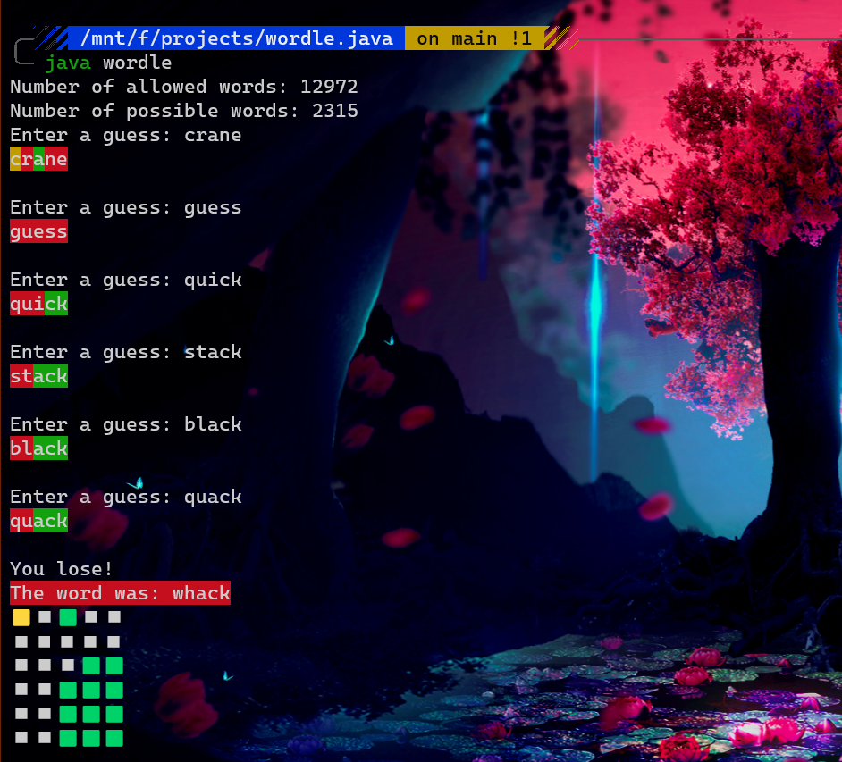

# Java implementation of the Worlde game

Assumptions: I assumed you use dark mode like a normal person, and colors are implemented for that. This might lead to non-readable output for light mode terminals.

## Guidelines

1. Clone this repository

2. Compile the program using the command `javac wordle.java`

3. Run the program using the command `java wordle`

## Credits

* The game Wordle is entirely and purely inspired from the game [Worlde](https://www.powerlanguage.co.uk/wordle/).

* The allowed_word list and possible_word list in `/data` is taken from [3Blue1Brown's repo](https://github.com/3b1b/videos/tree/master/_2022/wordle_data)
* The solver program algorithm is entirely inspired by the awesome video by Grant Sanderson (3Blue1Brown) on using information theory to solve wordle puzzles - [here](https://www.youtube.com/watch?v=v68zYyaEmEA), just implemented in java instead of python

Note: This is just a very crude implementation of the game, to be used in the automatic solver program in https://github.com/ArvindAROO/Wordle-Solver (repo private? guess it's not complete yet)
